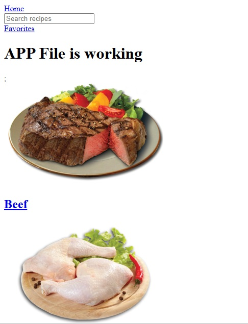

### Advanced React - Recipe Discovery App

The most challenging part of this project was managing the flow of data between API calls, routing, and global state while keeping the application stable. Handling asynchronous requests with proper loading and error states took some time, especially when working with dynamic routes like the recipe detail page. There were also a few issues around undefined data and routing mismatches that caused blank screens, which required careful debugging.

One important design decision I made was using custom hooks like `useFetch` and `useLocalStorage`. This helped separate data-fetching logic from UI components, making the code more reusable and easier to maintain. I also used the Context API to manage the favorites feature globally so that users could add or remove recipes from any page without prop drilling. Overall, this structure helped keep the application organized, scalable, and easier to debug while working with multiple API endpoints.

#### Screenshot

